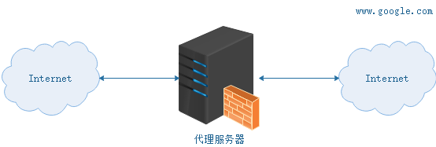

Nginx 是一款高性能的 HTTP 服务器/反向代理服务器及电子邮件（IMAP/POP3）代理服务器。官方测试 Nginx 能够支支撑 5 万并发链接，并且 CPU、内存等资源消耗却非常低，运行非常稳定。ngin如何进行网管负载均衡，缓存，访问控制，api计量和监控

## Nginx 的应用场景

- HTTP 服务器：Nginx 是一个 HTTP 服务可以独立提供 HTTP 服务。可以做网页静态服务器。
- 虚拟主机：可以实现在一台服务器虚拟出多个网站。例如个人网站使用的虚拟主机。
- 反向代理，负载均衡：当网站的访问量达到一定程度后，单台服务器不能满足用户的请求时，需要用多台服务器集群可以使用 Nginx 做反向代理。并且多台服务器可以平均分担负载，不会因为某台服务器负载高宕机而某台服务器闲置的情况。


## 1.代理服务器

代理服务器，客户机在发送请求时，不会直接发送给目的主机，而是先发送给代理服务器，代理服务接受客户机请求之后，再向主机发出，并接收目的主机返回的数据，存放在代理服务器的硬盘中，再发送给客户机。


## 为什么要使用代理服务器？

### [#](#提高访问速度)提高访问速度

由于目标主机返回的数据会存放在代理服务器的硬盘中，因此下一次客户再访问相同的站点数据时，会直接从代理服务器的硬盘中读取，起到了缓存的作用，尤其对于热门站点能明显提高请求速度。

### [#](#防火墙作用)防火墙作用

由于所有的客户机请求都必须通过代理服务器访问远程站点，因此可在代理服务器上设限，过滤某些不安全信息。

### [#](#通过代理服务器访问不能访问的目标站点)通过代理服务器访问不能访问的目标站点

互联网上有许多开放的代理服务器，客户机在访问受限时，可通过不受限的代理服务器访问目标站点，通俗说，我们使用的翻墙浏览器就是利用了代理服务器，虽然不能出国，但也可直接访问外网。


## [#](#什么是正向代理？)什么是正向代理？

正向代理，架设在客户机与目标主机之间，只用于代理内部网络对 Internet 的连接请求，客户机必须指定代理服务器,并将本来要直接发送到 Web 服务器上的 Http 请求发送到代理服务器中。




## [#](#什么是反向代理？)什么是反向代理？

反向代理服务器架设在服务器端，通过缓冲经常被请求的页面来缓解服务器的工作量，将客户机请求转发给内部网络上的目标服务器；并将从服务器上得到的结果返回给 Internet 上请求连接的客户端，此时代理服务器与目标主机一起对外表现为一个服务器。


## [#](#反向代理有哪些主要应用？)反向代理有哪些主要应用？

现在许多大型 web 网站都用到反向代理。除了可以防止外网对内网服务器的恶性攻击、缓存以减少服务器的压力和访问安全控制之外，还可以进行负载均衡，将用户请求分配给多个服务器。

## [#](#使用-nginx-反向代理-tomcat)使用 Nginx 反向代理 Tomcat

### [#](#需求)需求

- 两个 tomcat 服务通过 nginx 反向代理
- nginx 服务器：192.168.75.145:80
- tomcat1 服务器：192.168.75.145:9090
- tomcat2 服务器：192.168.75.145:9091

### 配置 Nginx 反向代理

修改 `/usr/local/docker/nginx/conf` 目录下的 nginx.conf 配置文件：

```bash
user  nginx;
worker_processes  1;

events {
    worker_connections  1024;
}

http {
    include       mime.types;
    default_type  application/octet-stream;

    sendfile        on;

    keepalive_timeout  65;
	
	# 配置一个代理即 tomcat1 服务器
	upstream tomcatServer1 {
		server 192.168.75.145:9090;
	}

	# 配置一个代理即 tomcat2 服务器
	upstream tomcatServer2 {
		server 192.168.75.145:9091;
	}

	# 配置一个虚拟主机
	server {
		listen 80;
		server_name admin.service.itoken.funtl.com;
		location / {
				# 域名 admin.service.itoken.funtl.com 的请求全部转发到 tomcat_server1 即 tomcat1 服务上
				proxy_pass http://tomcatServer1;
				# 欢迎页面，按照从左到右的顺序查找页面
				index index.jsp index.html index.htm;
		}
	}

	server {
		listen 80;
		server_name admin.web.itoken.funtl.com;

		location / {
			# 域名 admin.web.itoken.funtl.com 的请求全部转发到 tomcat_server2 即 tomcat2 服务上
			proxy_pass http://tomcatServer2;
			index index.jsp index.html index.htm;
		}
	}
}
```

**注意：新版 Nginx 的 `upstream` 配置中的名称不可以有下划线("_")，否则会报 `400` 错误**


## 什么是负载均衡

负载均衡建立在现有网络结构之上，它提供了一种廉价有效透明的方法扩展网络设备和服务器的带宽、增加吞吐量、加强网络数据处理能力、提高网络的灵活性和可用性。负载均衡，英文名称为 Load Balance，其意思就是分摊到多个操作单元上进行执行，例如 Web 服务器、FTP 服务器、企业关键应用服务器和其它关键任务服务器等，从而共同完成工作任务。

## [#]( #nginx-实现负载均衡)Nginx 实现负载均衡

- nginx 作为负载均衡服务器，用户请求先到达 nginx，再由 nginx 根据负载配置将请求转发至 tomcat 服务器
- nginx 负载均衡服务器：192.168.75.145:80
- tomcat1 服务器：192.168.75.145:9090
- tomcat2 服务器：192.168.75.145:9091

### [#]( #nginx-配置负载均衡)Nginx 配置负载均衡

修改 `/usr/local/docker/nginx/conf` 目录下的 nginx.conf 配置文件：

```text
user  nginx;
worker_processes  1;

events {
    worker_connections  1024;
}

http {
    include       mime.types;
    default_type  application/octet-stream;

    sendfile        on;

    keepalive_timeout  65;
	
	upstream myapp1 {
		server 192.168.75.145:9090 weight=10;
		server 192.168.75.145:9091 weight=10;
	}

	server {
		listen 80;
		server_name nginx.funtl.com;
		location / {
			proxy_pass http://myapp1;
			index index.jsp index.html index.htm;
		}
	}
}
```


### [#]( #相关配置说明)相关配置说明

```bash
# 定义负载均衡设备的 Ip及设备状态 
upstream myServer {
    server 127.0.0.1:9090 down;
    server 127.0.0.1:8080 weight=2;
    server 127.0.0.1:6060;
    server 127.0.0.1:7070 backup;
}
```

在需要使用负载的 Server 节点下添加

```bash
proxy_pass http://myServer;
```

- `upstream`：每个设备的状态:
- `down`：表示当前的 `server` 暂时不参与负载
- `weight`：默认为 1 `weight` 越大，负载的权重就越大。
- `max_fails`：允许请求失败的次数默认为 1 当超过最大次数时，返回 `proxy_next_upstream` 模块定义的错误
- `fail_timeout`:`max_fails` 次失败后，暂停的时间。
- `backup`：其它所有的非 `backup` 机器 `down` 或者忙的时候，请求 `backup` 机器。所以这台机器压力会最轻


# [#]( #nginx-实现负载均衡)Nginx 静态服务器