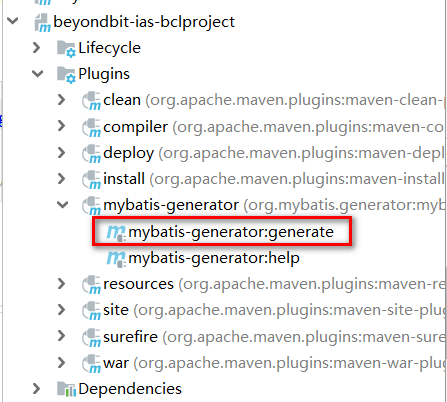
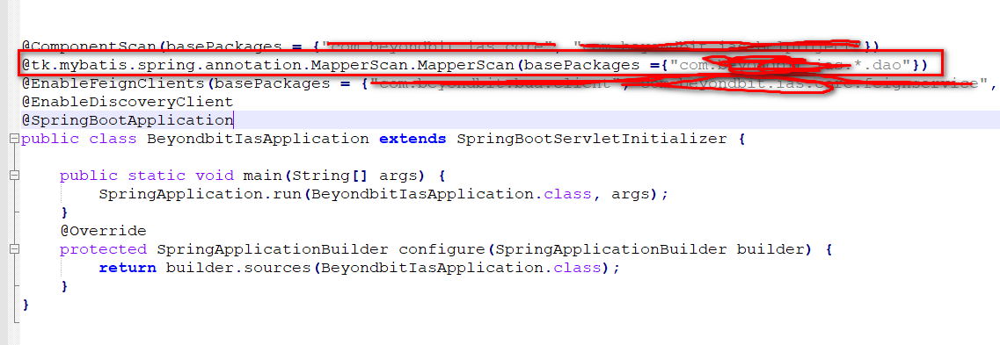
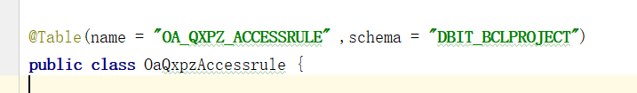
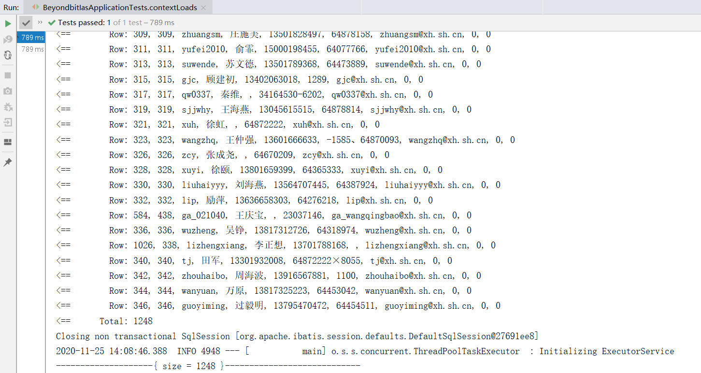
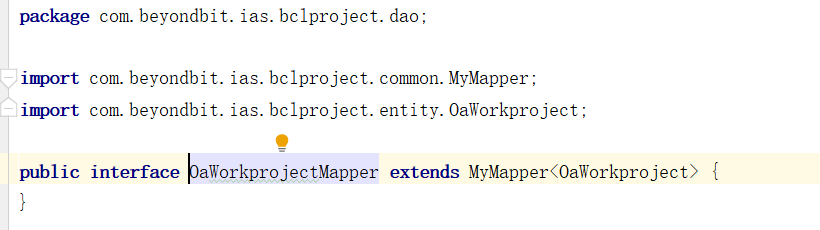
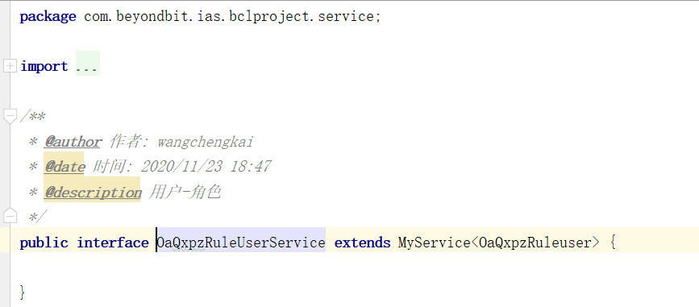
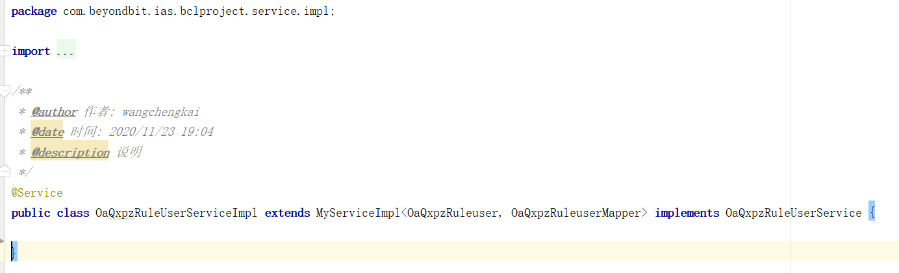
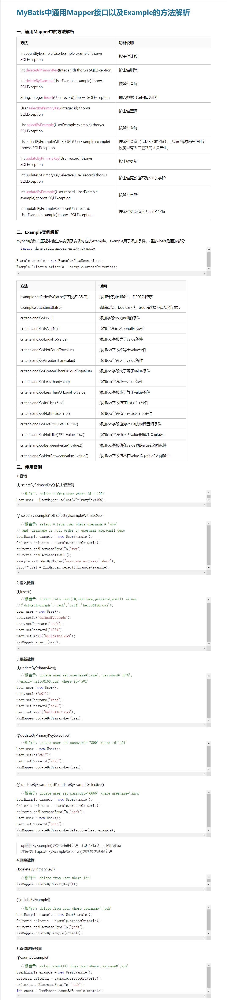

不知各位程序君在开发过程中, 是否依旧还在在为手动创建entity实体类/dao层接口以及Mapper.xml中疯狂追加sql语句而烦恼吗 ?那么接下来将通过介绍如何使用tk.mybatis来提升开发效率!

## 快速上手

### 1. 在项目的pom.xml文件中引入 `mapper-spring-boot-starter` 依赖

``` java
 <dependency>
        <groupId>tk.mybatis</groupId>
        <artifactId>mapper-spring-boot-starter</artifactId>
        <version>2.0.2</version>
    </dependency>
```

该依赖会自动引入 MyBaits 相关依赖

### 2. 在pom.xml 中添加mybatis-generator-maven-plugin 插件

``` bash
<build>
    <plugins>
        <plugin>
            <groupId>org.mybatis.generator</groupId>
            <artifactId>mybatis-generator-maven-plugin</artifactId>
            <version>1.3.5</version>
            <configuration>
                <configurationFile>${basedir}/src/main/resources/generator/generatorConfig.xml</configurationFile>
                <overwrite>true</overwrite>
                <verbose>true</verbose>
            </configuration>
            <dependencies>
                <dependency>
                    <groupId>mysql</groupId>
                    <artifactId>mysql-connector-java</artifactId>
                    <version>${mysql.version}</version>
                </dependency>
                <dependency>
                    <groupId>tk.mybatis</groupId>
                    <artifactId>mapper</artifactId>
                    <version>3.4.4</version>
                </dependency>
            </dependencies>
        </plugin>
    </plugins>
</build>
```

该插件是 MyBatis 的 Maven 插件用于自动生成实体类,Mapper接口和mapper.xml文件

### 3. 设置 mybatis-generator-maven-plugin 插件自动生成代码配置

``` java
<?xml version="1.0" encoding="UTF-8"?>
<!DOCTYPE generatorConfiguration
        PUBLIC "-//mybatis.org//DTD MyBatis Generator Configuration 1.0//EN"
        "http://mybatis.org/dtd/mybatis-generator-config_1_0.dtd">

<generatorConfiguration>
    <!-- 引入数据库连接配置 -->
    <context id="KingbaseES8" targetRuntime="MyBatis3Simple" defaultModelType="flat">
        <property name="beginningDelimiter" value="`"/>
        <property name="endingDelimiter" value="`"/>

        <!-- 配置 tk.mybatis 插件 -->
        <plugin type="tk.mybatis.mapper.generator.MapperPlugin">
            <property name="mappers" value="com.beyondbit.ias.bclproject.common.MyMapper"/>
        </plugin>

        <!-- 配置数据库连接 -->
        <jdbcConnection
                driverClass="com.kingbase8.Driver"
                connectionURL="jdbc:kingbase8://31.0.37.96:54321/DBIT_XH"
                userId="system"
                password="System#1234">
        </jdbcConnection>

        <!-- 配置实体类存放路径 -->
        <javaModelGenerator targetPackage="com.beyondbit.ias.bclproject.entity" targetProject="src/main/java">
            <!--  for MyBatis3/MyBatis3Simple
          自动为每一个生成的类创建一个构造方法，构造方法包含了所有的field；而不是使用setter；
       -->
            <property name="constructorBased" value="false"/>

            <!-- 在targetPackage的基础上，根据数据库的schema再生成一层package，最终生成的类放在这个package下，默认为false -->
            <property name="enableSubPackages" value="true"/>

            <!-- for MyBatis3 / MyBatis3Simple
                是否创建一个不可变的类，如果为true，
                那么MBG会创建一个没有setter方法的类，取而代之的是类似constructorBased的类
             -->
            <property name="immutable" value="false"/>

            <!-- 设置一个根对象，
                如果设置了这个根对象，那么生成的keyClass或者recordClass会继承这个类；在Table的rootClass属性中可以覆盖该选项
                注意：如果在key class或者record class中有root class相同的属性，MBG就不会重新生成这些属性了，包括：
                    1，属性名相同，类型相同，有相同的getter/setter方法；
             -->
            <property name="BaseEntity" value="com.beyondbit.ias.bclproject.entity"/>

            <!-- 设置是否在getter方法中，对String类型字段调用trim()方法 -->
            <property name="trimStrings" value="true"/>
        </javaModelGenerator>

        <!-- 配置 XML 存放路径 -->
        <sqlMapGenerator targetPackage="mapper" targetProject="src/main/resources"/>

        <!-- 配置 DAO 存放路径 -->
        <javaClientGenerator
                targetPackage="com.beyondbit.ias.bclproject.dao"
                targetProject="src/main/java"
                type="XMLMAPPER">
            <!-- 在targetPackage的基础上，根据数据库的schema再生成一层package，最终生成的类放在这个package下，默认为false -->
            <property name="enableSubPackages" value="true"/>

        </javaClientGenerator>

        <!-- 配置需要指定生成的数据库和表，% 代表所有表 -->
        <table catalog="DBIT_XH" tableName="OA_%">
            <!-- 默认为false，如果设置为true，在生成的SQL中，table名字不会加上catalog或schema； -->
            <property name="ignoreQualifiersAtRuntime" value="false"/>
        </table>
    </context>
</generatorConfiguration><?xml version="1.0" encoding="UTF-8"?>
<!DOCTYPE generatorConfiguration
        PUBLIC "-//mybatis.org//DTD MyBatis Generator Configuration 1.0//EN"
        "http://mybatis.org/dtd/mybatis-generator-config_1_0.dtd">

<generatorConfiguration>
    <!-- 引入数据库连接配置 -->
    <context id="KingbaseES8" targetRuntime="MyBatis3Simple" defaultModelType="flat">
        <property name="beginningDelimiter" value="`"/>
        <property name="endingDelimiter" value="`"/>

        <!-- 配置 tk.mybatis 插件 -->
        <plugin type="tk.mybatis.mapper.generator.MapperPlugin">
            <property name="mappers" value="com.beyondbit.ias.bclproject.common.MyMapper"/>
        </plugin>

        <!-- 配置数据库连接 -->
        <jdbcConnection
                driverClass="com.kingbase8.Driver"
                connectionURL="jdbc:kingbase8://31.0.37.96:54321/DBIT_XH"
                userId="system"
                password="System#1234">
        </jdbcConnection>

        <!-- 配置实体类存放路径 -->
        <javaModelGenerator targetPackage="com.beyondbit.ias.bclproject.entity" targetProject="src/main/java">
            <!--  for MyBatis3/MyBatis3Simple
          自动为每一个生成的类创建一个构造方法，构造方法包含了所有的field；而不是使用setter；
       -->
            <property name="constructorBased" value="false"/>

            <!-- 在targetPackage的基础上，根据数据库的schema再生成一层package，最终生成的类放在这个package下，默认为false -->
            <property name="enableSubPackages" value="true"/>

            <!-- for MyBatis3 / MyBatis3Simple
                是否创建一个不可变的类，如果为true，
                那么MBG会创建一个没有setter方法的类，取而代之的是类似constructorBased的类
             -->
            <property name="immutable" value="false"/>

            <!-- 设置一个根对象，
                如果设置了这个根对象，那么生成的keyClass或者recordClass会继承这个类；在Table的rootClass属性中可以覆盖该选项
                注意：如果在key class或者record class中有root class相同的属性，MBG就不会重新生成这些属性了，包括：
                    1，属性名相同，类型相同，有相同的getter/setter方法；
             -->
            <property name="BaseEntity" value="com.beyondbit.ias.bclproject.entity"/>

            <!-- 设置是否在getter方法中，对String类型字段调用trim()方法 -->
            <property name="trimStrings" value="true"/>
        </javaModelGenerator>

        <!-- 配置 XML 存放路径 -->
        <sqlMapGenerator targetPackage="mapper" targetProject="src/main/resources"/>

        <!-- 配置 DAO 存放路径 -->
        <javaClientGenerator
                targetPackage="com.beyondbit.ias.bclproject.dao"
                targetProject="src/main/java"
                type="XMLMAPPER">
            <!-- 在targetPackage的基础上，根据数据库的schema再生成一层package，最终生成的类放在这个package下，默认为false -->
            <property name="enableSubPackages" value="true"/>

        </javaClientGenerator>

        <!-- 配置需要指定生成的数据库和表，% 代表所有表 -->
        <table catalog="DBIT_XH" tableName="OA_%">
            <!-- 默认为false，如果设置为true，在生成的SQL中，table名字不会加上catalog或schema； -->
            <property name="ignoreQualifiersAtRuntime" value="false"/>
        </table>
    </context>
</generatorConfiguration>
```

在src/main/resources下新建generator目录,然后在generator目录下在新建一个generatorConfig.xml文件,然后在该文件中配置自动生成代码的相关详情 --- 注意该配置文件中的数据库连接池配置根据个人项目实际情况去配置,本人这里使用的是国产数据库金仓,

### 4. 在application.yml中配置mybatis

``` java
mybatis:
    type-aliases-package: //实体类的存放路径，如:com.beyondbit.ias.*.entity
    mapper-locations: classpath:mapper/*.xml  
    configuration: 
      map-underscore-to-camel-case: true //开启驼峰功能
      log-impl: org.apache.ibatis.logging.stdout.StdOutImpl //sql控制台打印
    configuration-properties: { dbSchema: DBIT_BCLPROJECT. } //配置数据库的模式

```

###  5. 创建一个通用的父级MyMapper接口 

``` java
package com.beyondbit.ias.xhlh.utils;

import tk.mybatis.mapper.common.Mapper;
import tk.mybatis.mapper.common.MySqlMapper;

/**
 * MyMapper 作为tk.mybatis提供的通用mapper父级接口
 * 特别注意，该接口不能被@mapperScan注解的路径扫描到，否则会出错
 * <p>Title: MyMapper</p>
 * <p>Description: </p>
 *
 * @author wangchengkai
 * @version 1.0.0
 * @date 2020/11/25 0:17
 */
public interface MyMapper<T> extends Mapper<T>, MySqlMapper<T> {
}
```

*** 特别注意该接口千万不能被mapperScan扫描到 

### 6.  利用插件执行自动生成代码 (实体类/mapper接口和mapper.xml代码)

##### (1) 方式一  :  打开idea或者eclipse的Terminal 终端输入的命令   mvn mybatis-generator:generate   回车

##### (2) 方式二 : 进入项目根目录文件然后cmd进入终端 输入命令 mvn mybatis-generator:generate   回车

##### (3) 方式三 : 利用idea的maven 插件通过双击 执行自动生成代码 



 


```java
[INFO] Scanning for projects...
[INFO] 
[INFO] ------------------------------------------------------------------------
[INFO] Building hello-spring-boot 0.0.1-SNAPSHOT
[INFO] ------------------------------------------------------------------------
[INFO] 
[INFO] --- mybatis-generator-maven-plugin:1.3.5:generate (default-cli) @ hello-spring-boot ---
[INFO] Connecting to the Database
[INFO] Introspecting table %
[INFO] Generating Record class for table tb_order
[INFO] Generating Mapper Interface for table tb_order
[INFO] Generating SQL Map for table tb_order
[INFO] Generating Record class for table tb_item_cat
[INFO] Generating Mapper Interface for table tb_item_cat
[INFO] Generating SQL Map for table tb_item_cat
[INFO] Generating Record class for table tb_item_desc
[INFO] Generating Mapper Interface for table tb_item_desc
[INFO] Generating SQL Map for table tb_item_desc
[INFO] Generating Record class for table tb_order_shipping
[INFO] Generating Mapper Interface for table tb_order_shipping
[INFO] Generating SQL Map for table tb_order_shipping
[INFO] Generating Record class for table tb_user
[INFO] Generating Mapper Interface for table tb_user
[INFO] Generating SQL Map for table tb_user
[INFO] Generating Record class for table tb_content
[INFO] Generating Mapper Interface for table tb_content
[INFO] Generating SQL Map for table tb_content
[INFO] Generating Record class for table tb_item_param_item
[INFO] Generating Mapper Interface for table tb_item_param_item
[INFO] Generating SQL Map for table tb_item_param_item
[INFO] Generating Record class for table tb_order_item
[INFO] Generating Mapper Interface for table tb_order_item
[INFO] Generating SQL Map for table tb_order_item
[INFO] Generating Record class for table tb_content_category
[INFO] Generating Mapper Interface for table tb_content_category
[INFO] Generating SQL Map for table tb_content_category
[INFO] Generating Record class for table tb_item
[INFO] Generating Mapper Interface for table tb_item
[INFO] Generating SQL Map for table tb_item
[INFO] Generating Record class for table tb_item_param
[INFO] Generating Mapper Interface for table tb_item_param
[INFO] Generating SQL Map for table tb_item_param
[INFO] Saving file TbOrderMapper.xml
[INFO] Saving file TbItemCatMapper.xml
[INFO] Saving file TbItemDescMapper.xml
[INFO] Saving file TbOrderShippingMapper.xml
[INFO] Saving file TbUserMapper.xml
[INFO] Saving file TbContentMapper.xml
[INFO] Saving file TbItemParamItemMapper.xml
[INFO] Saving file TbOrderItemMapper.xml
[INFO] Saving file TbContentCategoryMapper.xml
[INFO] Saving file TbItemMapper.xml
[INFO] Saving file TbItemParamMapper.xml
[INFO] Saving file TbOrder.java
[INFO] Saving file TbOrderMapper.java
[INFO] Saving file TbItemCat.java
[INFO] Saving file TbItemCatMapper.java
[INFO] Saving file TbItemDesc.java
[INFO] Saving file TbItemDescMapper.java
[INFO] Saving file TbOrderShipping.java
[INFO] Saving file TbOrderShippingMapper.java
[INFO] Saving file TbUser.java
[INFO] Saving file TbUserMapper.java
[INFO] Saving file TbContent.java
[INFO] Saving file TbContentMapper.java
[INFO] Saving file TbItemParamItem.java
[INFO] Saving file TbItemParamItemMapper.java
[INFO] Saving file TbOrderItem.java
[INFO] Saving file TbOrderItemMapper.java
[INFO] Saving file TbContentCategory.java
[INFO] Saving file TbContentCategoryMapper.java
[INFO] Saving file TbItem.java
[INFO] Saving file TbItemMapper.java
[INFO] Saving file TbItemParam.java
[INFO] Saving file TbItemParamMapper.java
[WARNING] Column id, specified as an identity column in table tb_order, does not exist in the table.
[WARNING] Column id, specified as an identity column in table tb_item_desc, does not exist in the table.
[WARNING] Column id, specified as an identity column in table tb_order_shipping, does not exist in the table.
[INFO] ------------------------------------------------------------------------
[INFO] BUILD SUCCESS
[INFO] ------------------------------------------------------------------------
[INFO] Total time: 2.901 s
[INFO] Finished at: 2018-05-29T01:24:17+08:00
[INFO] Final Memory: 12M/192M
[INFO] ------------------------------------------------------------------------
```
当出现BUILD SUCCESS时表示代码自动生成成功,这时你就可以看到项目中已经生成的实体类, mapper 接口和mapper.xml文件了


###  7. 在启动类中添加dao层接口的扫描路径 @MapperScan(basePackages = "com.xxx.*.dao")  

#####  注意: 该 @MapperScan import使用的是 import tk.mybatis.spring.annotation.MapperScan;



###  8. 在所有的实体类上的@Table注解中加入schema属性 



###  9. 创建通用的service接口和实现

##### 通过上面的操作我们的所有实体类和mapper.xml以及dao层接口均已自动生成,并且dao层的所有接口均已继承MyMapper通用父级接口获取了所有单表操作的封装方法,此时我们的dao层单表操作既可以做到零代码实现了 !在spring mvc架构中我们知道控制器controller调用service,service调用mapper接口, 此时mapper接口以及通过父级MyMapper接口完成了统一的单表操作封装。 那么接下来我们就对service层做统一封装, 实现service层单表操作的零代码 。 ------ 在你项目的common(或者utils,亦或者service)的package新建一个BaseService接口和BaseServiceImpl实现类(类名根据个人爱好)

##### 新建service层所有接口的父级service, 让service层所有的接口继承该父级BaseService

```java
package com.beyondbit.ias.bclproject.common;

import com.github.pagehelper.PageInfo;
import tk.mybatis.mapper.entity.Example;

import java.util.List;

/**
 * BaseService 作为sevice层提供的通用service父级接口
 * @author wangchengkai
 * @version 1.0.0
 * @date 2020/11/25 0:20
 */
public interface BaseService<T> {

    /**
     * 根据实体类中不为空的字段作为where语句的条件使用=号
     * @param var1
     * @return 返回查询列表
     */
    List<T> select(T var1);

    /**
     * 根据实体类中不为空的字段作为where语句的条件使用=号
     * @param var1
     * @return 一个实体
     */
    T selectOne(T var1);

    /**
     * 根据实体类中不为空的字段作为where语句的条件使用=号
     * @param var1
     * @return 按条件查询的统计条数
     */
    int selectCount(T var1);

    /**
     * 根据实体类中的主键id作作为where语句的查询条件 
     * ---注意实体类中的主键必须加@ID注解此方法才生效
     * @param var1
     * @return 返回根据主键id查询到的实体
     */
    T selectByPrimaryKey(Object var1);

    /**
     * 自定义条件查询
     * @param example
     * @return 返回根据自定义查询条件/排序/分组/分页/去重....等获取到的列表
     */
    List<T>  selectByExample(Example example);

    /**
     * 查询表中的所有数据
     * @param
     * @return 返回表中的所有数据
     */
    List<T> selectAll();

    /**
     * 分页查询表中的所有数据
     * @param
     * @return 返回分页查询到的表中的所有数据
     */
    PageInfo<T> selectAllPage(Integer pageNum, Integer pageSize);

    /**
     * 根据主键查询该数据是否存在
     * @param
     * @return 存在true 不存在false
     */
    boolean existsWithPrimaryKey(T var1);

    /**
     * 根据主键作为where查询条件修改数据(此方法当实体类中的属性为null时会将数据库中队一个的字段也修改为null)
     * 个人不怎么推荐使用本方法 ---注意实体类中的主键必须加@ID注解此方法才生效
     * @param
     * @return 存在true 不存在false
     */
    int updateByPrimaryKey(T var1);

    /**
     * 根据主键作为where查询条件修改数据(此方法只修改实体类中不为null属性所对应的字段)
     * 个人强烈推荐使用本方法修改数据 ---注意实体类中的主键必须加@ID注解此方法才生效
     * @param
     * @return 存在true 不存在false
     */
    int updateByPrimaryKeySelective(T var1);


    /**
     * 插入数据(实体类中为null属性所对应的字段也设置为null不会使用默认值)
     * @param
     * @return 存在true 不存在false
     */
    int insert(T var1);

    /**
     * 插入数据(实体类中为null属性所对应的字段会使用默认值)
     * 个人强烈推荐使用本方法新增数据
     * @param
     * @return 存在true 不存在false
     */
    int insertSelective(T var1);

    /**
     * 删除数据(实体类中属性非空字段作为where 查询的条件 用and 拼接)
     * @param
     * @return  
     */
    int delete(T var1);


    /**
     * 根据主键删除数据 ---注意实体类中的主键必须加@ID注解此方法才生效
     * @param
     * @return
     */
    int deleteByPrimaryKey(T var1);

    
    PageInfo<T> selectPage(Integer pageNum, Integer pageSize,T var1);
}

```

##### 新建service层所有接口的父级接口, 让service层所有的实现类继承该父级BaseServiceImpl

```java
package com.beyondbit.ias.bclproject.common;

import com.github.pagehelper.PageHelper;
import com.github.pagehelper.PageInfo;
import org.springframework.beans.factory.annotation.Autowired;
import org.springframework.transaction.annotation.Transactional;
import tk.mybatis.mapper.entity.Example;

import java.lang.reflect.ParameterizedType;
import java.util.List;

/**
 * BaseServiceImpl 作为sevice层提供的通用service实现类的父级类
 * @author wangchengkai
 * @version 1.0.0
 * @date 2020/11/25 0:20
 */
public abstract class BaseServiceImpl<T, E extends MyMapper<T>> implements MyService<T> {


    @Autowired
    private E dao;

    /**
     * 当前泛型真实类型的Class
     */
    private Class<T> modelClass;

    public MyServiceImpl() {
        ParameterizedType pt = (ParameterizedType) this.getClass().getGenericSuperclass();
        modelClass = (Class<T>) pt.getActualTypeArguments()[0];
    }


    @Override
    public List select(T var1) {
        return dao.select(var1);
    }

    @Override
    public T selectOne(T var1) {
        return dao.selectOne(var1);
    }


    @Override
    public int selectCount(T var1) {
        return dao.selectCount(var1);
    }

    @Override
    public T selectByPrimaryKey(Object var1) {
        return dao.selectByPrimaryKey(var1);
    }

    @Override
    public List selectAll() {
        return dao.selectAll();
    }

    @Override
    public PageInfo<T> selectAllPage(Integer pageNum, Integer pageSize) {
        PageHelper.startPage(pageNum == null ? 0 : pageNum, pageSize == null ? 0 : pageSize);
        PageInfo<T> pageInfo = new PageInfo<T>(dao.selectAll());
        return pageInfo;
    }

    @Override
    public PageInfo<T> selectPage(Integer pageNum, Integer pageSize, T var1) {
        PageHelper.startPage(pageNum == null ? 0 : pageNum, pageSize == null ? 0 : pageSize);
        PageInfo<T> pageInfo = new PageInfo<T>(dao.select(var1));
        return pageInfo;
    }

    @Override
    public boolean existsWithPrimaryKey(Object var1) {
        return dao.existsWithPrimaryKey(var1);
    }

    @Override
    @Transactional
    public int updateByPrimaryKey(T var1) {
        return dao.updateByPrimaryKey(var1);
    }

    @Override
    @Transactional
    public int updateByPrimaryKeySelective(T var1) {
        return dao.updateByPrimaryKeySelective(var1);
    }

    @Override
    public List selectByExample(Example example) {
        return dao.selectByExample(example);
    }

    @Override
    @Transactional
    public int insert(T var1) {
        return dao.insert(var1);
    }

    @Override
    @Transactional
    public int insertSelective(T var1) {
        return dao.insertSelective(var1);
    }

    @Override
    @Transactional
    public int delete(T var1) {
        return dao.delete(var1);
    }

    @Override
    @Transactional
    public int deleteByPrimaryKey(Object var1) {
        return dao.deleteByPrimaryKey(var1);
    }


}

```

#### 10. 测试




##### 查询测试成功!  那么我们可以看一下service层和dao层的代码







####  11. tk.mybatis先关通用api详情

